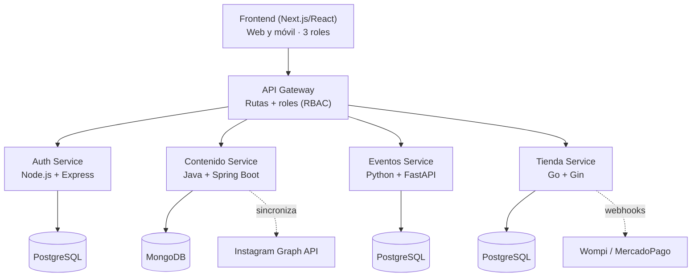

# Rollerblading Architecture
## General Overview
An only frontend (Next.js/React) which comunicates with an API Gateway, which routes the request to four microservices, each one in a different language and its own database.

## tier stack
| tier            | technology                                   | resposibility                                                                             |
| --------------- | -------------------------------------------- | ----------------------------------------------------------------------------------------- |
| Frontend        | Next.js + React + Tailwind CSS               | render eigth website sections, responsive mobile/PC, call the API through the API Gateway |
| API Gateway     | Nginx / Kong (or own gateway implementation) | route, initial validation of JWT, rate limiting                                           |
| Auth Service    | Node.js + Express + PostgreSQL               | register, login, JWT generation, manage of three roles (roller, admin, invited)           |
| Content Service | Java + Spring Boot + MongoDB                 | History, Instagram posts, colaborators, entrepreneurship, Social Media / Contact          |
| Events Service  | Python + FastAPI + PostgreSQL                | Events, inscriptions, schedules                                                           |
| Store Service   | Go + Gin + PostgreSQL                        | Products catalog, orders, payments                                                        |

## Mapping of sections to services
| #   | Section                              | Service         |
| --- | ------------------------------------ | --------------- |
| 1   | Group History                        | Content (Java)  |
| 2   | Main Feed (Instagram)                | Content (Java)  |
| 3   | Events                               | Events (Python) |
| 4   | Schedule                             | Events (Python) |
| 5   | Store                                | Store (Go)      |
| 6   | Social Media / Contact               | Content (Java)  |
| 7   | Colaborators                         | Content (Java)  |
| 8   | Entrepreneurship and Roller Services | Content (Java)  |

## Roles
- **Invited**: without account, can only access to the public sections of the website (sections 1, 2, 6, 7, 8).
- **Roller**: registered user, it could buy products, publish products for sale (pending admin approval), publish entrepreneurship or services, etc (sections 1, 2, 3, 4, 5, 6, 7, 8).
- **Admin**: registered user with admin role, it could manage the content of the website (sections 1, 2, 3, 4, 5, 6, 7, 8).

the role travel in the JWT created by the Auth Service. the API Gateway makes a basic token's validatio, but **each microservice validate again the role** before to execute any action - never trust just what the fronted hide.

## Comunication between services
- Frontend <-> API Gateway <-> Microservices: **REST over HTTPS** (it could be migrate to gRPC in the future if it needs performance).
- References crossed between services (eg. `user_id` in store) are saved as simple UUID, **without real foreign keys** between different databases.
- Content Service synchronize periodically with **Instagram Graph API** (job scheduler, not real-time).
- Store Service receive **webhooks** from payment providers (Wompi, MercadoPago) to update the status of the orders.

## Deployment
- Frontend -> Vercel.
- Each microservice -> docker container deployed in Railway/Render/Fly.io (or Kubernetes cluster in the future).
- Databases -> managed instances (Neon/Supabase for PostgreSQL, MongoDB Atlas for MongoDB).
- All the local environment would up with `docker-compose up` for development and testing.